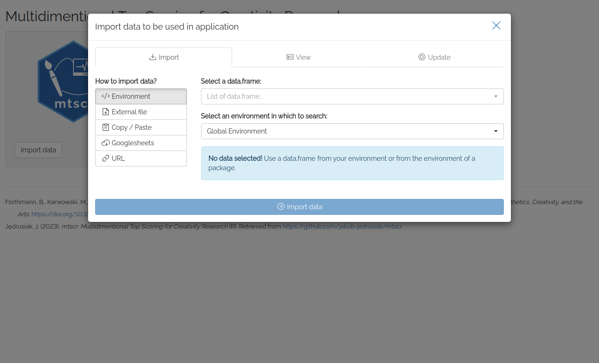

<!-- README.md is generated from README.Rmd. Please edit that file -->

```{r, include = FALSE}
knitr::opts_chunk$set(
  collapse = TRUE,
  comment = "#>",
  fig.path = "man/figures/README-",
  out.width = "100%"
)
```

# Multidimensional Top Scoring for Creativity Research  {#multidimensional-top-scoring-for-creativity-research}

<!-- badges: start -->
[](https://lifecycle.r-lib.org/articles/stages.html#stable)
[](https://CRAN.R-project.org/package=mtscr)
[](https://github.com/jakub-jedrusiak/mtscr/actions/workflows/R-CMD-check.yaml)
[](https://app.codecov.io/gh/jakub-jedrusiak/mtscr)
<!-- badges: end -->

In creativity research, we often want to extract person-level divergent thinking indices from response-level scores. In the field there are discussions whether grand mean or top-scoring is more valid way of summarising these scores. A new method called Multidimensional Top Scoring presented by Forthmann, Karwowski and Beaty ([2023](https://doi.org/10.1037/aca0000571)) combines the strengths of both approaches. This package is an R adaptation of that method.

## Installation {#installation}

Install mtscr with:

``` r
install.packages("mtscr")
```

You can install the development version of mtscr from [GitHub](https://github.com/) with:

``` r
# install.packages("devtools")
devtools::install_github("jakub-jedrusiak/mtscr")
```

## Usage {#usage}

The basic usage involves fitting a model with `mtscr()` function and using it to predict some scores. **Note that you still need some response-level scores!** This package only aggegates them into person-level scores. For automatic scoring see [Ocsai](https://openscoring.du.edu/scoringllm) and [`openscoring`](https://github.com/jakub-jedrusiak/openscoring) package. This package includes a sample dataset `mtscr_creativity` with 4652 responses to the [Alternative Uses Task](https://en.wikipedia.org/wiki/Guilford%27s_Alternate_Uses) with semantic distance scored. The dataset comes from the original paper (Forthmann, Karwowski and Beaty, [2023](https://doi.org/10.1037/aca0000571)).

### Fitting the model

The model(s) can be fitted with `mtscr()`. It takes a dataframe with responses, an ID column, a score column, and (optionally) an item column as arguments. See the help page (`?mtscr()`) for more details.

```{r}
library("mtscr")
data("mtscr_creativity", package = "mtscr")

fit <- mtscr(mtscr_creativity, id, SemDis_MEAN, item, top = 1:3)
```

The model can be summarised to obtain the parameters and reliability estimates.

```{r}
summary(fit)
```

### Getting the scores

Then you can add your socres to your database or extract them by person using `predict()`.

```{r}
# For a single model
predict(fit$top1)

# For a whole list of models
predict(fit)
```

You can also extract person-level scores only by setting `minimal = TRUE`.

```{r}
predict(fit, minimal = TRUE)
```

You can achieve more standard behaviour of `predict()` by also setting `id_col = FALSE`. Then you can assign the result to a column manually.

```{r}
mtscr_creativity$score <- predict(fit, id_col = FALSE)

mtscr_creativity |>
  tidyr::unnest_wider(score, names_sep = "_") # Use to expand list-col
```

### Simple top-scoring

This package also includes a function to quickly calculate the mean score and the top-X scores. You can do that through `top_socring()`. This function accepts preety much the same arguments as `mtscr()`, but it returns a data frame with scores instead of a model. It also calculates a simple mean by default.

```{r}
top_scoring(mtscr_creativity, id, SemDis_MEAN, item, top = 1:3)
```

You can get the top-X scores for each item separately by setting `by_item = TRUE`. If you want best scores no matter the item, do not set the `item_column` argument. If you set `by_item = FALSE` (or don't explicitly set it) and set `item_column`, first the by item means will be calculated and then the person-score will be the mean of these means. Control what to do if less than top answers are present (e.g., you want top-3 but someone came up with only 2 ideas) with `na_if_less` argument. By default, the function will calculate the scores based on the available number of ideas, but you can set it to `TRUE` to return `NA` if there are not enough ideas.

Simple top-scoring is also availabe through the GUI, see below.

### Graphical User Interface {#graphical-user-interface}

This package includes a Shiny app which can be used as a GUI. You can find "mtscr GUI" option in RStudio's Addins menu. Alternatively execute `mtscr_app()` to run it.



> Try web based version [here](https://shiny.jakubjedrusiak.pl/mtscr/)!

First thing you see after running the app is [`datamods`](https://github.com/dreamRs/datamods) window for importing your data. You can use the data already loaded in your environment or any other option. Then you'll see four dropdown lists used to choose arguments for the functions. Consult the documentation for more details (execute `?mtscr` in the console). When the parameters are chosen, click "Generate model" button. After a while (up to a dozen or so seconds) models' parameters and are shown along with a scored dataframe.

You can download your data as a .csv or an .xlsx file using buttons in the sidebar. You can either download the scores only (i.e. the dataframe you see displayed) or your whole data with scores columns added.

For testing purposes, you may use `mtscr_creativity` dataframe. In the importing window change "Global Environment" to "mtscr" and our dataframe should appear in the upper dropdown list. Use `id` for the ID column, `item` for the item column and `SemDis_MEAN` for the score column.

## Contact {#contact}

Correspondence concerning the meritorical side of these solutions should be addressed to Boris Forthmann, Institute of Psychology, University of Münster, Fliednerstrasse 21, 48149 Münster, Germany. Email: [boris.forthmann\@wwu.de](mailto:boris.forthmann@wwu.de){.email}.

The maintainer of the R package is Jakub Jędrusiak and the technical concerns should be directed to him. Well, me. Best way is to open a [discussion on GitHub](https://github.com/jakub-jedrusiak/mtscr/discussions). Technical difficulties may deserve an [issue](https://github.com/jakub-jedrusiak/mtscr/issues).
