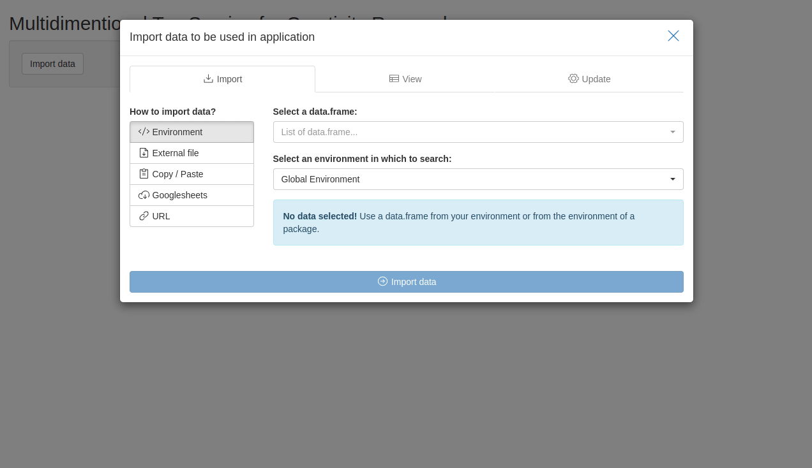

<!-- README.md is generated from README.Rmd. Please edit that file -->

# Multidimensional Top Scoring for Creativity Research 

<!-- badges: start -->

[](https://lifecycle.r-lib.org/articles/stages.html#stable)
[](https://CRAN.R-project.org/package=mtscr)
[](https://github.com/jakub-jedrusiak/mtscr/actions/workflows/R-CMD-check.yaml)
[](https://app.codecov.io/gh/jakub-jedrusiak/mtscr)
<!-- badges: end -->

In creativity research, we often want to extract person-level divergent
thinking indices from response-level scores. In the field there are
discussions whether grand mean or top-scoring is more valid way of
summarising these scores. A new method called Multidimensional Top
Scoring presented by Forthmann, Karwowski and Beaty
([2023](https://doi.org/10.1037/aca0000571)) combines the strengths of
both approaches. This package is an R adaptation of that method.

## Installation

Install mtscr with:

``` r
install.packages("mtscr")
```

You can install the development version of mtscr from
[GitHub](https://github.com/) with:

``` r
# install.packages("devtools")
devtools::install_github("jakub-jedrusiak/mtscr")
```

## Usage

The basic usage involves fitting a model with `mtscr()` function and
using it to predict some scores. **Note that you still need some
response-level scores!** This package only aggegates them into
person-level scores. For automatic scoring see
[Ocsai](https://openscoring.du.edu/scoringllm) and
[`openscoring`](https://github.com/jakub-jedrusiak/openscoring) package.
This package includes a sample dataset `mtscr_creativity` with 4652
responses to the [Alternative Uses
Task](https://en.wikipedia.org/wiki/Guilford%27s_Alternate_Uses) with
semantic distance scored. The dataset comes from the original paper
(Forthmann, Karwowski and Beaty,
[2023](https://doi.org/10.1037/aca0000571)).

### Fitting the model

The model(s) can be fitted with `mtscr()`. It takes a dataframe with
responses, an ID column, a score column, and (optionally) an item column
as arguments. See the help page (`?mtscr()`) for more details.

``` r
library("mtscr")
data("mtscr_creativity", package = "mtscr")

fit <- mtscr(mtscr_creativity, id, SemDis_MEAN, item, top = 1:3)
```

The model can be summarised to obtain the parameters and reliability
estimates.

``` r
summary(fit)
#> # A tibble: 3 × 9
#>   model  nobs sigma logLik    AIC    BIC df.residual emp_rel   FDI
#>   <chr> <int> <dbl>  <dbl>  <dbl>  <dbl>       <int>   <dbl> <dbl>
#> 1 top1   4585 0.736 -5298. 10657. 10850.        4555   0.877 0.936
#> 2 top2   4585 0.767 -5472. 11003. 11196.        4555   0.892 0.944
#> 3 top3   4585 0.825 -5777. 11613. 11806.        4555   0.896 0.947
```

### Getting the scores

Then you can add your socres to your database or extract them by person
using `predict()`.

``` r
# For a single model
predict(fit$top1)
#> # A tibble: 4,585 × 5
#>       id response    item   SemDis_MEAN  top1
#>    <dbl> <chr>       <chr>        <dbl> <dbl>
#>  1 84176 ruler       pencil       0.876 0.142
#>  2 84176 nose picker pencil       0.959 0.142
#>  3 84176 scratch ear pencil       1.02  0.142
#>  4 84176 hammer      clock        0.871 0.142
#>  5 84176 table       clock        0.837 0.142
#>  6 84176 direction   clock        0.9   0.142
#>  7 84176 coaster     clock        0.938 0.142
#>  8 84176 latter      clock        0.979 0.142
#>  9 84176 ladder      bucket       0.763 0.142
#> 10 84176 seat        bucket       0.823 0.142
#> # ℹ 4,575 more rows

# For a whole list of models
predict(fit)
#> # A tibble: 4,585 × 7
#>       id response    item   SemDis_MEAN  top1   top2    top3
#>    <dbl> <chr>       <chr>        <dbl> <dbl>  <dbl>   <dbl>
#>  1 84176 ruler       pencil       0.876 0.142 0.0681 -0.0516
#>  2 84176 nose picker pencil       0.959 0.142 0.0681 -0.0516
#>  3 84176 scratch ear pencil       1.02  0.142 0.0681 -0.0516
#>  4 84176 hammer      clock        0.871 0.142 0.0681 -0.0516
#>  5 84176 table       clock        0.837 0.142 0.0681 -0.0516
#>  6 84176 direction   clock        0.9   0.142 0.0681 -0.0516
#>  7 84176 coaster     clock        0.938 0.142 0.0681 -0.0516
#>  8 84176 latter      clock        0.979 0.142 0.0681 -0.0516
#>  9 84176 ladder      bucket       0.763 0.142 0.0681 -0.0516
#> 10 84176 seat        bucket       0.823 0.142 0.0681 -0.0516
#> # ℹ 4,575 more rows
```

You can also extract person-level scores only by setting
`minimal = TRUE`.

``` r
predict(fit, minimal = TRUE)
#> # A tibble: 149 × 4
#>       id    top1    top2    top3
#>    <dbl>   <dbl>   <dbl>   <dbl>
#>  1 84176  0.142   0.0681 -0.0516
#>  2 84177 -0.508  -0.494  -0.444 
#>  3 84178 -0.0733 -0.0995 -0.0774
#>  4 84188  0.529   0.527   0.455 
#>  5 84193 -0.299  -0.350  -0.256 
#>  6 84206 -0.312  -0.301  -0.371 
#>  7 84211 -0.0464  0.0356  0.129 
#>  8 84226  0.238   0.210   0.0902
#>  9 84228  0.137   0.139   0.102 
#> 10 84236  0.459   0.422   0.409 
#> # ℹ 139 more rows
```

You can achieve more standard behaviour of `predict()` by also setting
`id_col = FALSE`. Then you can assign the result to a column manually.

``` r
mtscr_creativity$score <- predict(fit, id_col = FALSE)

mtscr_creativity |>
  tidyr::unnest_wider(score, names_sep = "_") # Use to expand list-col
#> # A tibble: 4,585 × 11
#>       id response    item   SemDis_MEAN score_id score_response score_item
#>    <dbl> <chr>       <chr>        <dbl>    <dbl> <chr>          <chr>     
#>  1 84176 ruler       pencil       0.876    84176 ruler          pencil    
#>  2 84176 nose picker pencil       0.959    84176 nose picker    pencil    
#>  3 84176 scratch ear pencil       1.02     84176 scratch ear    pencil    
#>  4 84176 hammer      clock        0.871    84176 hammer         clock     
#>  5 84176 table       clock        0.837    84176 table          clock     
#>  6 84176 direction   clock        0.9      84176 direction      clock     
#>  7 84176 coaster     clock        0.938    84176 coaster        clock     
#>  8 84176 latter      clock        0.979    84176 latter         clock     
#>  9 84176 ladder      bucket       0.763    84176 ladder         bucket    
#> 10 84176 seat        bucket       0.823    84176 seat           bucket    
#> # ℹ 4,575 more rows
#> # ℹ 4 more variables: score_SemDis_MEAN <dbl>, score_top1 <dbl>,
#> #   score_top2 <dbl>, score_top3 <dbl>
```

### Graphical User Interface

This package includes a Shiny app which can be used as a GUI. You can
find “mtscr GUI” option in RStudio’s Addins menu. Alternatively execute
`mtscr_app()` to run it.



> Try web based version [here](https://shiny.jakubjedrusiak.pl/mtscr/)!

First thing you see after running the app is
[`datamods`](https://github.com/dreamRs/datamods) window for importing
your data. You can use the data already loaded in your environment or
any other option. Then you’ll see four dropdown lists used to choose
arguments for the functions. Consult the documentation for more details
(execute `?mtscr` in the console). When the parameters are chosen, click
“Generate model” button. After a while (up to a dozen or so seconds)
models’ parameters and are shown along with a scored dataframe.

You can download your data as a .csv or an .xlsx file using buttons in
the sidebar. You can either download the scores only (i.e. the dataframe
you see displayed) or your whole data with scores columns added.

For testing purposes, you may use `mtscr_creativity` dataframe. In the
importing window change “Global Environment” to “mtscr” and our
dataframe should appear in the upper dropdown list. Use `id` for the ID
column, `item` for the item column and `SemDis_MEAN` for the score
column.

## Contact

Correspondence concerning the meritorical side of these solutions should
be addressed to Boris Forthmann, Institute of Psychology, University of
Münster, Fliednerstrasse 21, 48149 Münster, Germany. Email:
<boris.forthmann@wwu.de>.

The maintainer of the R package is Jakub Jędrusiak and the technical
concerns should be directed to him. Well, me. Best way is to open a
[discussion on
GitHub](https://github.com/jakub-jedrusiak/mtscr/discussions). Technical
difficulties may deserve an
[issue](https://github.com/jakub-jedrusiak/mtscr/issues).
